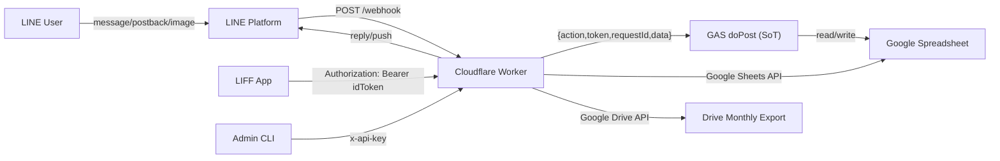

(I) FINAL ARCHITECTURE

## Diagram (mermaid)



## Security boundary explanation
- Public boundary is Cloudflare Worker only.
- LIFF/browser clients call Worker APIs only; GAS endpoint is not exposed to frontend.
- Worker calls GAS using fixed envelope `{ action, token, requestId, data }`.
- Admin operations are protected by `x-api-key` and/or admin LINE user allowlist.
- Webhook validates LINE signature from raw body.

## Data lifecycle (shift → traffic → hotel → monthly export)
1. Shift ingestion:
- LINE text webhook -> Worker -> GAS `shift.raw.ingest` + `shift.parse.run`.
- Sheets updated: `SHIFT_RAW`, `SHIFT_ASSIGNMENTS`.

2. Traffic/expense input:
- LIFF manual/OCR draft -> Worker `/api/traffic/create` -> GAS `traffic.create` -> `TRAFFIC_LOG`.
- LIFF expense -> Worker `/api/expense/create` -> Google Sheets append -> `EXPENSE_LOG`.

3. Hotel lifecycle:
- Worker `/api/hotel/push` -> GAS `hotel.intent.targets` + `hotel.sendGuard` -> LINE push.
- User postback -> GAS `hotel.intent.submit` -> `HOTEL_INTENT_LOG`.
- Admin screenshot image -> Worker OCR/Gemini -> match assignments -> `HOTEL_CONFIRMED_LOG` + `HOTEL_SCREENSHOT_RAW`; unmatched -> `ADMIN_ALERTS` via `ops.log`.

4. Monthly export:
- Worker `/api/monthly/export` aggregates:
  - `SHIFT_ASSIGNMENTS`
  - `TRAFFIC_LOG`
  - `EXPENSE_LOG`
  - `HOTEL_INTENT_LOG`
  - `HOTEL_CONFIRMED_LOG`
- Worker creates `Monthly_Report_YYYY_MM` with 5 tabs in Drive and logs to `MONTHLY_EXPORT_LOG`.


(II) DATABASE DESIGN (FINAL)

Pre-created:
- SHIFT
  - `month,workDate,project,userId,name,siteId,siteName,siteAddress,siteNearestStation`
- TRAFFIC_LOG
  - `timestamp,userId,name,project,workDate,fromStation,toStation,amount,roundTrip,memo`
- EXPENSE_LOG (new, required)
  - `timestamp,userId,name,project,workDate,category,amount,paymentMethod,memo,status,requestId`

Auto-created:
- SHIFT_RAW
  - `rawMessageId,timestamp,source,lineGroupId,lineUserId,rawText,parserVersion,parseStatus,error,requestId`
- SHIFT_ASSIGNMENTS
  - `assignmentId,rawMessageId,userId,rawLine,parserVersion,siteId,siteNameNorm,siteRaw,sitePeriodFromDay,sitePeriodToDay,role,segmentFromDay,segmentToDay,staffNameRaw,staffKanaRaw,status,createdAt`
- STAFF_MASTER
  - `userId,name,project,lineUserId,status,updatedAt`
- SITE_MASTER
  - `siteId,projectId,workDate,siteName,siteAddress,nearestStations,aliases,updatedAt`
- HOTEL_INTENT_LOG
  - `timestamp,userId,projectId,workDate,needHotel,smoking,source,status`
- HOTEL_SENT_LOG
  - `date,projectId,lineUserId,status,requestId,createdAt`
- HOTEL_CONFIRMED_LOG (new)
  - `timestamp,workDate,userId,lineUserId,name,hotel,source,status,rawMessageId,requestId`
- HOTEL_SCREENSHOT_RAW (new)
  - `timestamp,messageId,adminLineUserId,targetUserId,ocrName,ocrHotel,ocrDate,mimeType,bytes,status,requestId,rawOcrJson`
- REMINDER_SENT_LOG
  - `date,lineUserId,status,requestId,createdAt`
- ADMIN_ALERTS
  - `alertId,timestamp,requestId,severity,source,event,message,payloadJson,status`
- MONTHLY_EXPORT_LOG (new)
  - `timestamp,month,fileId,fileUrl,userCount,siteCount,trafficRows,expenseRows,hotelRows,totalTraffic,totalExpense,totalCost,requestId,status`


(III) MONTHLY FILE GENERATION FEATURE

Implemented endpoint:
- `POST /api/monthly/export`

Input:
- `{ "month": "YYYY-MM" }`

Flow:
1. Auth:
- `x-api-key` OR LIFF idToken (LIFF mode requires admin user ID allowlisted).

2. Aggregate source sheets:
- `SHIFT_ASSIGNMENTS`
- `TRAFFIC_LOG`
- `EXPENSE_LOG`
- `HOTEL_INTENT_LOG`
- `HOTEL_CONFIRMED_LOG`

3. Build structured dataset:
- Per-user summary:
  - shiftDays, trafficCount/total, expenseCount/total, hotelNeed, hotelConfirmed, totalCost
- Per-site summary:
  - shiftAssignments, uniqueUsers, trafficTotal, expenseTotal, hotelConfirmed, totalCost
- Totals:
  - `traffic`, `expense`, `cost`

4. Export file creation (Worker-side Drive export):
- File name: `Monthly_Report_YYYY_MM`
- Tabs:
  1. `User_Summary`
  2. `Site_Summary`
  3. `Raw_Traffic`
  4. `Raw_Expense`
  5. `Hotel_Status`

5. Post-log:
- Append export metadata to `MONTHLY_EXPORT_LOG`.
- Send audit event to GAS `ops.log` (`worker.monthly.export`).

Response:
- `{ fileUrl, fileId, rowCounts, totals }`

Code:
- `worker/src/handlers/monthly.js`
- `worker/src/clients/google.js`
- Route wiring in `worker/src/router.js`


(IV) LIFF FULL UI IMPLEMENTATION

### liff/index.html
```html
<!doctype html>
<html lang="ja">
<head>
  <meta charset="UTF-8" />
  <meta name="viewport" content="width=device-width, initial-scale=1" />
  <title>Project1 Business Automation</title>
  <link rel="stylesheet" href="./style.css" />
  <script src="https://static.line-scdn.net/liff/edge/2/sdk.js"></script>
</head>
<body>
  <main class="app-shell">
    <header class="hero">
      <div class="hero-top">
        <h1>Project1</h1>
        <span id="roleBadge" class="role-badge">USER</span>
      </div>
      <p>LINE業務自動化ポータル</p>
      <div id="sessionInfo" class="session-info">LIFF未初期化</div>
    </header>

    <section class="card env-card">
      <h2>接続先</h2>
      <p id="workerEndpointLabel" class="mono"></p>
      <label for="devApiKey">x-api-key (管理者検証用・任意)</label>
      <input id="devApiKey" type="password" autocomplete="off" placeholder="任意" />
      <p class="hint">全APIは Worker 経由で呼び出します。GAS はブラウザから直接呼びません。</p>
    </section>

    <nav class="tab-bar" aria-label="LIFF tabs">
      <button class="tab active" data-tab="dashboard">今月状況</button>
      <button class="tab" data-tab="traffic">交通費申請（手打ち）</button>
      <button class="tab" data-tab="ocr">OCR申請</button>
      <button class="tab" data-tab="expense">立替経費申請</button>
      <button class="tab" data-tab="hotel">ホテル回答状況</button>
      <button id="tabMonthly" class="tab tab-admin" data-tab="monthly">月次ファイル生成</button>
    </nav>

    <section id="screenDashboard" class="card screen active">
      <div class="section-head">
        <h2>今月状況</h2>
        <div class="inline-actions">
          <input id="dashboardMonth" type="month" />
          <button id="dashboardRefreshButton" type="button">更新</button>
        </div>
      </div>

      <div class="metric-grid">
        <article class="metric-card">
          <h3>今月シフト日数</h3>
          <p id="metricShiftDays" class="metric-value">-</p>
        </article>
        <article class="metric-card">
          <h3>交通費合計</h3>
          <p id="metricTrafficTotal" class="metric-value">-</p>
        </article>
        <article class="metric-card">
          <h3>経費合計</h3>
          <p id="metricExpenseTotal" class="metric-value">-</p>
        </article>
        <article class="metric-card">
          <h3>未提出交通</h3>
          <p id="metricUnsubmittedTraffic" class="metric-value">-</p>
        </article>
        <article class="metric-card">
          <h3>ホテル未回答</h3>
          <p id="metricHotelUnanswered" class="metric-value">-</p>
        </article>
        <article class="metric-card">
          <h3>ホテル確定</h3>
          <p id="metricHotelConfirmed" class="metric-value">-</p>
        </article>
      </div>
    </section>

    <section id="screenTraffic" class="card screen">
      <h2>交通費申請（手打ち）</h2>
      <form id="manualForm" class="form-grid">
        <label>勤務日
          <input id="manualWorkDate" type="date" required />
        </label>
        <label>出発駅
          <input id="manualFromStation" type="text" required />
        </label>
        <label>到着駅
          <input id="manualToStation" type="text" required />
        </label>
        <label>金額
          <input id="manualAmount" type="number" min="1" required />
        </label>
        <label>片道/往復
          <select id="manualRoundTrip">
            <option value="片道">片道</option>
            <option value="往復">往復</option>
          </select>
        </label>
        <label>プロジェクト
          <input id="manualProject" type="text" />
        </label>
        <label>氏名
          <input id="manualName" type="text" />
        </label>
        <label class="field-span-2">メモ
          <input id="manualMemo" type="text" />
        </label>
        <button id="manualSubmit" type="submit">送信</button>
      </form>
    </section>

    <section id="screenOcr" class="card screen">
      <h2>OCR申請</h2>
      <form id="ocrExtractForm" class="form-grid">
        <label>画像
          <input id="ocrImage" type="file" accept="image/*" required />
        </label>
        <label>勤務日
          <input id="ocrWorkDate" type="date" required />
        </label>
        <label>プロジェクト
          <input id="ocrProject" type="text" />
        </label>
        <label>氏名
          <input id="ocrName" type="text" />
        </label>
        <button id="ocrExtractButton" type="submit">OCR実行</button>
      </form>

      <h3>抽出ドラフト</h3>
      <form id="ocrDraftForm" class="form-grid">
        <label>userId
          <input id="draftUserId" type="text" required />
        </label>
        <label>氏名
          <input id="draftName" type="text" />
        </label>
        <label>プロジェクト
          <input id="draftProject" type="text" />
        </label>
        <label>勤務日
          <input id="draftWorkDate" type="date" required />
        </label>
        <label>出発駅
          <input id="draftFromStation" type="text" required />
        </label>
        <label>到着駅
          <input id="draftToStation" type="text" required />
        </label>
        <label>金額
          <input id="draftAmount" type="number" min="1" required />
        </label>
        <label>片道/往復
          <select id="draftRoundTrip">
            <option value="片道">片道</option>
            <option value="往復">往復</option>
          </select>
        </label>
        <label class="field-span-2">メモ
          <input id="draftMemo" type="text" />
        </label>
        <button id="ocrSubmitButton" type="submit">ドラフト送信</button>
      </form>
    </section>

    <section id="screenExpense" class="card screen">
      <h2>立替経費申請</h2>
      <form id="expenseForm" class="form-grid">
        <label>利用日
          <input id="expenseWorkDate" type="date" required />
        </label>
        <label>カテゴリ
          <input id="expenseCategory" type="text" placeholder="例: 備品 / 会議費" required />
        </label>
        <label>金額
          <input id="expenseAmount" type="number" min="1" required />
        </label>
        <label>支払方法
          <select id="expensePaymentMethod">
            <option value="advance">立替</option>
            <option value="corporate">法人カード</option>
            <option value="cash">現金</option>
          </select>
        </label>
        <label>プロジェクト
          <input id="expenseProject" type="text" />
        </label>
        <label>氏名
          <input id="expenseName" type="text" />
        </label>
        <label class="field-span-2">内容
          <input id="expenseMemo" type="text" required />
        </label>
        <button id="expenseSubmitButton" type="submit">経費送信</button>
      </form>
    </section>

    <section id="screenHotel" class="card screen">
      <div class="section-head">
        <h2>ホテル回答状況</h2>
        <button id="hotelRefreshButton" type="button">再取得</button>
      </div>

      <div class="status-grid">
        <article>
          <h3>回答済み日</h3>
          <ul id="hotelAnsweredDates" class="plain-list"></ul>
        </article>
        <article>
          <h3>未回答日</h3>
          <ul id="hotelUnansweredDates" class="plain-list"></ul>
        </article>
      </div>
      <p class="hint">画像によるホテル確定は、管理者が LINE へ画像投稿した際にWebhookで自動処理されます。</p>
    </section>

    <section id="screenMonthly" class="card screen">
      <h2>月次ファイル生成（管理者）</h2>
      <form id="monthlyForm" class="form-grid">
        <label>対象月
          <input id="monthlyMonth" type="month" required />
        </label>
        <label class="field-span-2">出力
          <input id="monthlyResultUrl" type="url" readonly placeholder="生成後にURLが表示されます" />
        </label>
        <button id="monthlyExportButton" type="submit">月次ファイル生成</button>
      </form>
    </section>

    <section class="card response-card">
      <h2>Response JSON</h2>
      <pre id="responseJson">{}</pre>
    </section>
  </main>

  <script type="module" src="./app.js"></script>
</body>
</html>
```

### liff/app.js
```js
const WORKER_ENDPOINT = 'https://<worker-domain>';
const LIFF_ID = '<LIFF_ID>';
const ADMIN_USER_IDS = ['<LINE_ADMIN_USER_ID>'];
const REQUEST_TIMEOUT_MS = 20000;

const state = {
  idToken: '',
  profile: null,
  isAdmin: false,
  lastDashboard: null
};

const el = {
  sessionInfo: document.getElementById('sessionInfo'),
  roleBadge: document.getElementById('roleBadge'),
  workerEndpointLabel: document.getElementById('workerEndpointLabel'),
  devApiKey: document.getElementById('devApiKey'),
  responseJson: document.getElementById('responseJson'),
  tabs: Array.from(document.querySelectorAll('.tab')),
  tabMonthly: document.getElementById('tabMonthly'),
  screens: {
    dashboard: document.getElementById('screenDashboard'),
    traffic: document.getElementById('screenTraffic'),
    ocr: document.getElementById('screenOcr'),
    expense: document.getElementById('screenExpense'),
    hotel: document.getElementById('screenHotel'),
    monthly: document.getElementById('screenMonthly')
  },
  dashboardMonth: document.getElementById('dashboardMonth'),
  dashboardRefreshButton: document.getElementById('dashboardRefreshButton'),
  metricShiftDays: document.getElementById('metricShiftDays'),
  metricTrafficTotal: document.getElementById('metricTrafficTotal'),
  metricExpenseTotal: document.getElementById('metricExpenseTotal'),
  metricUnsubmittedTraffic: document.getElementById('metricUnsubmittedTraffic'),
  metricHotelUnanswered: document.getElementById('metricHotelUnanswered'),
  metricHotelConfirmed: document.getElementById('metricHotelConfirmed'),
  manualForm: document.getElementById('manualForm'),
  manualWorkDate: document.getElementById('manualWorkDate'),
  manualFromStation: document.getElementById('manualFromStation'),
  manualToStation: document.getElementById('manualToStation'),
  manualAmount: document.getElementById('manualAmount'),
  manualRoundTrip: document.getElementById('manualRoundTrip'),
  manualProject: document.getElementById('manualProject'),
  manualName: document.getElementById('manualName'),
  manualMemo: document.getElementById('manualMemo'),
  manualSubmit: document.getElementById('manualSubmit'),
  ocrExtractForm: document.getElementById('ocrExtractForm'),
  ocrImage: document.getElementById('ocrImage'),
  ocrWorkDate: document.getElementById('ocrWorkDate'),
  ocrProject: document.getElementById('ocrProject'),
  ocrName: document.getElementById('ocrName'),
  ocrExtractButton: document.getElementById('ocrExtractButton'),
  ocrDraftForm: document.getElementById('ocrDraftForm'),
  draftUserId: document.getElementById('draftUserId'),
  draftName: document.getElementById('draftName'),
  draftProject: document.getElementById('draftProject'),
  draftWorkDate: document.getElementById('draftWorkDate'),
  draftFromStation: document.getElementById('draftFromStation'),
  draftToStation: document.getElementById('draftToStation'),
  draftAmount: document.getElementById('draftAmount'),
  draftRoundTrip: document.getElementById('draftRoundTrip'),
  draftMemo: document.getElementById('draftMemo'),
  ocrSubmitButton: document.getElementById('ocrSubmitButton'),
  expenseForm: document.getElementById('expenseForm'),
  expenseWorkDate: document.getElementById('expenseWorkDate'),
  expenseCategory: document.getElementById('expenseCategory'),
  expenseAmount: document.getElementById('expenseAmount'),
  expensePaymentMethod: document.getElementById('expensePaymentMethod'),
  expenseProject: document.getElementById('expenseProject'),
  expenseName: document.getElementById('expenseName'),
  expenseMemo: document.getElementById('expenseMemo'),
  expenseSubmitButton: document.getElementById('expenseSubmitButton'),
  hotelRefreshButton: document.getElementById('hotelRefreshButton'),
  hotelAnsweredDates: document.getElementById('hotelAnsweredDates'),
  hotelUnansweredDates: document.getElementById('hotelUnansweredDates'),
  monthlyForm: document.getElementById('monthlyForm'),
  monthlyMonth: document.getElementById('monthlyMonth'),
  monthlyResultUrl: document.getElementById('monthlyResultUrl'),
  monthlyExportButton: document.getElementById('monthlyExportButton')
};

bootstrap().catch((error) => {
  setSessionStatus(`LIFF初期化失敗: ${String(error?.message || error)}`, true);
  renderResponse('bootstrap.error', {
    ok: false,
    error: {
      code: 'E_LIFF_INIT',
      message: String(error?.message || error),
      details: {},
      retryable: false
    },
    meta: {
      requestId: '',
      timestamp: new Date().toISOString()
    }
  }, 500);
});

async function bootstrap() {
  el.workerEndpointLabel.textContent = WORKER_ENDPOINT;
  bindTabs();
  bindForms();
  setDefaultDates();
  setMonthlyVisibility(false);
  await initLiffSession();
  await refreshDashboard();
}

function bindTabs() {
  for (const tab of el.tabs) {
    tab.addEventListener('click', () => activateTab(String(tab.dataset.tab || 'dashboard')));
  }
}

function bindForms() {
  el.dashboardRefreshButton.addEventListener('click', refreshDashboard);
  el.manualForm.addEventListener('submit', submitManualTraffic);
  el.ocrExtractForm.addEventListener('submit', runOcrExtract);
  el.ocrDraftForm.addEventListener('submit', submitOcrDraftTraffic);
  el.expenseForm.addEventListener('submit', submitExpense);
  el.hotelRefreshButton.addEventListener('click', refreshDashboard);
  el.monthlyForm.addEventListener('submit', submitMonthlyExport);
}

function setDefaultDates() {
  const today = ymdToday();
  const month = ymToday();

  el.dashboardMonth.value = month;
  el.manualWorkDate.value = today;
  el.ocrWorkDate.value = today;
  el.draftWorkDate.value = today;
  el.expenseWorkDate.value = today;
  el.monthlyMonth.value = month;
}

async function initLiffSession() {
  if (!window.liff) {
    throw new Error('LIFF SDK v2 is not loaded');
  }

  await window.liff.init({ liffId: LIFF_ID });
  if (!window.liff.isLoggedIn()) {
    window.liff.login({ redirectUri: window.location.href });
    return;
  }

  state.idToken = String(window.liff.getIDToken() || '');
  state.profile = await window.liff.getProfile();

  const userId = String(state.profile?.userId || '').trim();
  const displayName = String(state.profile?.displayName || '').trim();
  if (!userId) throw new Error('LIFF profile userId is empty');

  state.isAdmin = resolveIsAdmin(userId);
  setMonthlyVisibility(state.isAdmin);

  if (!el.manualName.value && displayName) el.manualName.value = displayName;
  if (!el.ocrName.value && displayName) el.ocrName.value = displayName;
  if (!el.expenseName.value && displayName) el.expenseName.value = displayName;
  if (!el.draftUserId.value) el.draftUserId.value = userId;

  el.roleBadge.textContent = state.isAdmin ? 'ADMIN' : 'USER';
  setSessionStatus(`LIFF ready userId=${userId} displayName=${displayName || '(none)'}`, false);
}

function resolveIsAdmin(userId) {
  const uid = String(userId || '').trim();
  const configured = ADMIN_USER_IDS
    .map((value) => String(value || '').trim())
    .filter((value) => value && !value.startsWith('<'));

  if (configured.length === 0) return false;
  return configured.includes(uid);
}

function setMonthlyVisibility(visible) {
  el.tabMonthly.hidden = !visible;
  el.screens.monthly.classList.toggle('hidden', !visible);
}

function activateTab(tabName) {
  if (tabName === 'monthly' && !state.isAdmin) {
    tabName = 'dashboard';
  }

  for (const tab of el.tabs) {
    const active = String(tab.dataset.tab || '') === tabName;
    tab.classList.toggle('active', active);
  }

  Object.entries(el.screens).forEach(([key, node]) => {
    const active = key === tabName;
    node.classList.toggle('active', active);
  });
}

async function refreshDashboard() {
  const userId = resolveActiveUserId();
  const month = String(el.dashboardMonth.value || '').trim();

  if (!userId) {
    renderValidationError('dashboard.validation', [{ field: 'userId', reason: 'required' }]);
    return;
  }

  toggleBusy(el.dashboardRefreshButton, true, '更新中...');
  try {
    const path = `/api/dashboard/month?userId=${encodeURIComponent(userId)}&month=${encodeURIComponent(month)}`;
    const result = await callWorkerJson(path, { method: 'GET' });
    renderResponse(`GET ${path}`, result.body, result.status);

    if (result.body?.ok) {
      state.lastDashboard = result.body.data || null;
      renderDashboardCards(result.body.data || {});
      renderHotelLists(result.body.data || {});
    }
  } finally {
    toggleBusy(el.dashboardRefreshButton, false, '更新');
  }
}

function renderDashboardCards(data) {
  const cards = data?.cards || {};
  el.metricShiftDays.textContent = numberText(cards.shiftDays);
  el.metricTrafficTotal.textContent = yenText(cards.trafficTotal);
  el.metricExpenseTotal.textContent = yenText(cards.expenseTotal);
  el.metricUnsubmittedTraffic.textContent = numberText(cards.unsubmittedTraffic);
  el.metricHotelUnanswered.textContent = numberText(cards.hotelUnanswered);
  el.metricHotelConfirmed.textContent = numberText(cards.hotelConfirmed);
}

function renderHotelLists(data) {
  const answered = Array.isArray(data?.details?.answeredHotelDates) ? data.details.answeredHotelDates : [];
  const planned = Array.isArray(data?.details?.plannedDates) ? data.details.plannedDates : [];
  const answeredSet = new Set(answered);
  const unanswered = planned.filter((date) => !answeredSet.has(date));

  fillList(el.hotelAnsweredDates, answered);
  fillList(el.hotelUnansweredDates, unanswered);
}

function fillList(node, values) {
  node.innerHTML = '';
  if (!values || values.length === 0) {
    const li = document.createElement('li');
    li.textContent = 'なし';
    node.appendChild(li);
    return;
  }

  for (const value of values) {
    const li = document.createElement('li');
    li.textContent = String(value || '');
    node.appendChild(li);
  }
}

async function submitManualTraffic(event) {
  event.preventDefault();

  const payload = {
    userId: resolveActiveUserId(),
    workDate: String(el.manualWorkDate.value || '').trim(),
    fromStation: String(el.manualFromStation.value || '').trim(),
    toStation: String(el.manualToStation.value || '').trim(),
    amount: Number(el.manualAmount.value || 0),
    roundTrip: String(el.manualRoundTrip.value || '片道').trim(),
    memo: String(el.manualMemo.value || '').trim(),
    project: String(el.manualProject.value || '').trim(),
    name: String(el.manualName.value || '').trim(),
    requestId: createRequestId('manual')
  };

  const validation = validateTrafficPayload(payload);
  if (validation.length > 0) {
    renderValidationError('traffic.validation', validation);
    return;
  }

  toggleBusy(el.manualSubmit, true, '送信中...');
  try {
    const result = await callWorkerJson('/api/traffic/create', {
      method: 'POST',
      body: payload,
      idempotencyKey: payload.requestId
    });
    renderResponse('POST /api/traffic/create', result.body, result.status);
    await refreshDashboard();
  } finally {
    toggleBusy(el.manualSubmit, false, '送信');
  }
}

async function runOcrExtract(event) {
  event.preventDefault();

  const file = el.ocrImage.files && el.ocrImage.files[0];
  if (!file) {
    renderValidationError('ocr.validation', [{ field: 'image', reason: 'required' }]);
    return;
  }

  const payload = {
    userId: resolveActiveUserId(),
    workDate: String(el.ocrWorkDate.value || '').trim(),
    projectId: String(el.ocrProject.value || '').trim(),
    name: String(el.ocrName.value || '').trim()
  };

  if (!payload.userId || !payload.workDate) {
    renderValidationError('ocr.validation', [
      { field: 'userId', reason: 'required' },
      { field: 'workDate', reason: 'required' }
    ]);
    return;
  }

  toggleBusy(el.ocrExtractButton, true, 'OCR実行中...');
  try {
    const image = await readImageAsBase64(file);
    const result = await callWorkerJson('/api/ocr/extract', {
      method: 'POST',
      body: {
        ...payload,
        imageBase64: image.base64,
        mimeType: image.mimeType
      }
    });

    renderResponse('POST /api/ocr/extract', result.body, result.status);

    if (result.body?.ok && result.body?.data?.normalizedClaimDraft) {
      fillDraftForm(result.body.data.normalizedClaimDraft);
      activateTab('ocr');
    }
  } finally {
    toggleBusy(el.ocrExtractButton, false, 'OCR実行');
  }
}

async function submitOcrDraftTraffic(event) {
  event.preventDefault();

  const requestId = createRequestId('ocr');
  const payload = {
    userId: String(el.draftUserId.value || '').trim(),
    name: String(el.draftName.value || '').trim(),
    project: String(el.draftProject.value || '').trim(),
    workDate: String(el.draftWorkDate.value || '').trim(),
    fromStation: String(el.draftFromStation.value || '').trim(),
    toStation: String(el.draftToStation.value || '').trim(),
    amount: Number(el.draftAmount.value || 0),
    roundTrip: String(el.draftRoundTrip.value || '片道').trim(),
    memo: String(el.draftMemo.value || '').trim(),
    requestId
  };

  const validation = validateTrafficPayload(payload);
  if (validation.length > 0) {
    renderValidationError('ocr.draft.validation', validation);
    return;
  }

  toggleBusy(el.ocrSubmitButton, true, '送信中...');
  try {
    const result = await callWorkerJson('/api/traffic/create', {
      method: 'POST',
      body: payload,
      idempotencyKey: requestId
    });
    renderResponse('POST /api/traffic/create (OCR draft)', result.body, result.status);
    await refreshDashboard();
  } finally {
    toggleBusy(el.ocrSubmitButton, false, 'ドラフト送信');
  }
}

async function submitExpense(event) {
  event.preventDefault();

  const payload = {
    userId: resolveActiveUserId(),
    workDate: String(el.expenseWorkDate.value || '').trim(),
    category: String(el.expenseCategory.value || '').trim(),
    amount: Number(el.expenseAmount.value || 0),
    paymentMethod: String(el.expensePaymentMethod.value || 'advance').trim(),
    project: String(el.expenseProject.value || '').trim(),
    name: String(el.expenseName.value || '').trim(),
    memo: String(el.expenseMemo.value || '').trim(),
    requestId: createRequestId('expense')
  };

  const validation = validateExpensePayload(payload);
  if (validation.length > 0) {
    renderValidationError('expense.validation', validation);
    return;
  }

  toggleBusy(el.expenseSubmitButton, true, '送信中...');
  try {
    const result = await callWorkerJson('/api/expense/create', {
      method: 'POST',
      body: payload,
      idempotencyKey: payload.requestId
    });
    renderResponse('POST /api/expense/create', result.body, result.status);
    await refreshDashboard();
  } finally {
    toggleBusy(el.expenseSubmitButton, false, '経費送信');
  }
}

async function submitMonthlyExport(event) {
  event.preventDefault();

  if (!state.isAdmin) {
    renderValidationError('monthly.export', [{ field: 'admin', reason: 'forbidden' }]);
    return;
  }

  const month = String(el.monthlyMonth.value || '').trim();
  if (!month) {
    renderValidationError('monthly.validation', [{ field: 'month', reason: 'required' }]);
    return;
  }

  toggleBusy(el.monthlyExportButton, true, '生成中...');
  try {
    const result = await callWorkerJson('/api/monthly/export', {
      method: 'POST',
      body: { month }
    });

    renderResponse('POST /api/monthly/export', result.body, result.status);

    if (result.body?.ok && result.body?.data?.fileUrl) {
      el.monthlyResultUrl.value = String(result.body.data.fileUrl || '');
    }
  } finally {
    toggleBusy(el.monthlyExportButton, false, '月次ファイル生成');
  }
}

function fillDraftForm(draft) {
  el.draftUserId.value = String(draft?.userId || resolveActiveUserId() || '').trim();
  el.draftName.value = String(draft?.name || el.ocrName.value || '').trim();
  el.draftProject.value = String(draft?.project || el.ocrProject.value || '').trim();
  el.draftWorkDate.value = String(draft?.workDate || el.ocrWorkDate.value || ymdToday()).trim();
  el.draftFromStation.value = String(draft?.fromStation || '').trim();
  el.draftToStation.value = String(draft?.toStation || '').trim();
  el.draftAmount.value = Number(draft?.amount || 0) > 0 ? String(Number(draft.amount)) : '';
  el.draftRoundTrip.value = String(draft?.roundTrip || '片道').trim() === '往復' ? '往復' : '片道';
  el.draftMemo.value = String(draft?.memo || '').trim();
}

async function callWorkerJson(path, options = {}) {
  const method = String(options.method || 'GET').toUpperCase();
  const headers = new Headers();

  if (state.idToken) headers.set('Authorization', `Bearer ${state.idToken}`);
  const devApiKey = String(el.devApiKey.value || '').trim();
  if (devApiKey) headers.set('x-api-key', devApiKey);
  if (options.idempotencyKey) headers.set('x-idempotency-key', String(options.idempotencyKey));
  if (options.body !== undefined) headers.set('Content-Type', 'application/json');

  const response = await fetchWithTimeout(buildWorkerUrl(path), {
    method,
    headers,
    body: options.body !== undefined ? JSON.stringify(options.body) : undefined
  }, REQUEST_TIMEOUT_MS);

  const text = await response.text();
  let body;
  try {
    body = JSON.parse(text);
  } catch {
    body = {
      ok: false,
      error: {
        code: 'E_INVALID_JSON',
        message: 'Non-JSON response.',
        details: { raw: text },
        retryable: false
      },
      meta: {
        requestId: '',
        timestamp: new Date().toISOString()
      }
    };
  }

  return {
    status: response.status,
    body
  };
}

function fetchWithTimeout(url, options, timeoutMs) {
  const controller = new AbortController();
  const timer = setTimeout(() => controller.abort(), timeoutMs);
  return fetch(url, { ...options, signal: controller.signal }).finally(() => clearTimeout(timer));
}

function buildWorkerUrl(path) {
  const root = String(WORKER_ENDPOINT || '').replace(/\/+$/, '');
  const route = String(path || '').startsWith('/') ? path : `/${String(path || '')}`;
  return `${root}${route}`;
}

function resolveActiveUserId() {
  return String(state.profile?.userId || '').trim();
}

function validateTrafficPayload(payload) {
  const fields = [];
  if (!payload.userId) fields.push({ field: 'userId', reason: 'required' });
  if (!payload.workDate) fields.push({ field: 'workDate', reason: 'required' });
  if (!payload.fromStation) fields.push({ field: 'fromStation', reason: 'required' });
  if (!payload.toStation) fields.push({ field: 'toStation', reason: 'required' });
  if (!Number.isFinite(payload.amount) || payload.amount <= 0) fields.push({ field: 'amount', reason: 'must be > 0' });
  if (payload.roundTrip !== '片道' && payload.roundTrip !== '往復') fields.push({ field: 'roundTrip', reason: 'must be 片道 or 往復' });
  return fields;
}

function validateExpensePayload(payload) {
  const fields = [];
  if (!payload.userId) fields.push({ field: 'userId', reason: 'required' });
  if (!payload.workDate) fields.push({ field: 'workDate', reason: 'required' });
  if (!payload.category) fields.push({ field: 'category', reason: 'required' });
  if (!Number.isFinite(payload.amount) || payload.amount <= 0) fields.push({ field: 'amount', reason: 'must be > 0' });
  if (!payload.memo) fields.push({ field: 'memo', reason: 'required' });
  return fields;
}

function renderValidationError(scope, fields) {
  renderResponse(scope, {
    ok: false,
    error: {
      code: 'E_VALIDATION',
      message: 'Validation failed.',
      details: { fields },
      retryable: false
    },
    meta: {
      requestId: '',
      timestamp: new Date().toISOString()
    }
  }, 400);
}

function renderResponse(scope, body, status) {
  el.responseJson.textContent = JSON.stringify({
    route: scope,
    httpStatus: status,
    body
  }, null, 2);
}

function toggleBusy(button, busy, busyText) {
  if (!button) return;
  const defaultLabel = String(button.dataset.defaultLabel || button.textContent || '');
  if (!button.dataset.defaultLabel) button.dataset.defaultLabel = defaultLabel;
  button.disabled = Boolean(busy);
  button.textContent = busy ? busyText : defaultLabel;
}

function setSessionStatus(message, isError) {
  el.sessionInfo.textContent = message;
  el.sessionInfo.classList.toggle('error-text', Boolean(isError));
}

function numberText(value) {
  const n = Number(value || 0);
  if (!Number.isFinite(n)) return '-';
  return n.toLocaleString();
}

function yenText(value) {
  const n = Number(value || 0);
  if (!Number.isFinite(n)) return '-';
  return `${n.toLocaleString()}円`;
}

function ymToday() {
  const now = new Date();
  return `${now.getFullYear()}-${String(now.getMonth() + 1).padStart(2, '0')}`;
}

function ymdToday() {
  const now = new Date();
  return `${now.getFullYear()}-${String(now.getMonth() + 1).padStart(2, '0')}-${String(now.getDate()).padStart(2, '0')}`;
}

function createRequestId(prefix) {
  const safePrefix = String(prefix || 'req').replace(/[^a-z0-9_-]/gi, '').slice(0, 20) || 'req';
  if (window.crypto && typeof window.crypto.randomUUID === 'function') {
    return `${safePrefix}-${window.crypto.randomUUID()}`;
  }
  return `${safePrefix}-${Date.now()}-${Math.random().toString(16).slice(2, 10)}`;
}

function readImageAsBase64(file) {
  return new Promise((resolve, reject) => {
    const reader = new FileReader();
    reader.onload = () => {
      const dataUrl = String(reader.result || '');
      const commaIndex = dataUrl.indexOf(',');
      if (commaIndex < 0) {
        reject(new Error('Invalid data URL.'));
        return;
      }
      resolve({
        mimeType: String(file.type || 'image/jpeg'),
        base64: dataUrl.slice(commaIndex + 1)
      });
    };
    reader.onerror = () => reject(new Error('Failed to read image file.'));
    reader.readAsDataURL(file);
  });
}
```

### liff/style.css
```css
:root {
  --bg: #eef2f7;
  --panel: #ffffff;
  --ink: #12202f;
  --muted: #5d6b79;
  --line: #d7dfe7;
  --brand-dark: #101d2b;
  --brand-mid: #1d3248;
  --brand-accent: #2f6fa5;
  --ok: #2b7a45;
  --danger: #992b2b;
  --mono: "SFMono-Regular", "Menlo", "Consolas", monospace;
  --sans: "Noto Sans JP", "Hiragino Kaku Gothic ProN", "Yu Gothic", sans-serif;
}

* {
  box-sizing: border-box;
}

body {
  margin: 0;
  color: var(--ink);
  font-family: var(--sans);
  background:
    radial-gradient(circle at 90% -10%, #d7e7f6 0, transparent 42%),
    radial-gradient(circle at -20% 120%, #dceadf 0, transparent 40%),
    var(--bg);
}

.app-shell {
  max-width: 960px;
  margin: 0 auto;
  padding: 14px;
  display: grid;
  gap: 12px;
}

.hero {
  background: linear-gradient(140deg, var(--brand-dark), var(--brand-mid) 58%, #234567);
  color: #f4f8fc;
  border-radius: 16px;
  padding: 18px;
  box-shadow: 0 12px 28px rgba(10, 24, 41, 0.32);
}

.hero-top {
  display: flex;
  align-items: center;
  justify-content: space-between;
  gap: 12px;
}

.hero h1 {
  margin: 0;
  font-size: 24px;
  letter-spacing: 0.2px;
}

.hero p {
  margin: 8px 0 0;
  color: #d7e6f5;
}

.role-badge {
  display: inline-flex;
  align-items: center;
  justify-content: center;
  min-width: 68px;
  padding: 6px 10px;
  border: 1px solid rgba(255, 255, 255, 0.35);
  border-radius: 999px;
  font-size: 12px;
  letter-spacing: 0.8px;
}

.session-info {
  margin-top: 12px;
  background: rgba(255, 255, 255, 0.12);
  border: 1px solid rgba(255, 255, 255, 0.24);
  border-radius: 10px;
  padding: 8px 10px;
  font-size: 13px;
}

.card {
  background: var(--panel);
  border: 1px solid var(--line);
  border-radius: 14px;
  padding: 14px;
}

.card h2,
.card h3 {
  margin: 0 0 10px;
}

.section-head {
  display: flex;
  align-items: center;
  justify-content: space-between;
  gap: 10px;
  margin-bottom: 10px;
}

.inline-actions {
  display: flex;
  gap: 8px;
  align-items: center;
}

.tab-bar {
  display: grid;
  grid-template-columns: repeat(3, minmax(0, 1fr));
  gap: 8px;
}

.tab {
  min-height: 40px;
  border: 1px solid #c7d2df;
  background: #f6f9fc;
  color: #243648;
  border-radius: 10px;
  font-weight: 700;
}

.tab.active {
  background: #dbe9f8;
  border-color: #8fb7de;
  color: #173a5d;
}

.screen {
  display: none;
}

.screen.active {
  display: block;
}

.screen.hidden {
  display: none !important;
}

.metric-grid {
  display: grid;
  grid-template-columns: repeat(3, minmax(0, 1fr));
  gap: 10px;
}

.metric-card {
  border: 1px solid #d5dee8;
  border-radius: 12px;
  padding: 12px;
  background: linear-gradient(150deg, #f8fbff, #f5f8fb);
}

.metric-card h3 {
  margin: 0;
  font-size: 13px;
  color: var(--muted);
}

.metric-value {
  margin: 8px 0 0;
  font-size: 26px;
  font-weight: 800;
  letter-spacing: 0.3px;
}

.form-grid {
  display: grid;
  grid-template-columns: 1fr 1fr;
  gap: 10px;
}

.form-grid label {
  display: grid;
  gap: 6px;
  font-size: 13px;
  color: #35495e;
}

.field-span-2 {
  grid-column: 1 / -1;
}

input,
select,
button,
textarea {
  width: 100%;
  min-height: 42px;
  border: 1px solid #c8d4e1;
  border-radius: 10px;
  padding: 8px 10px;
  background: #fff;
  color: var(--ink);
  font-family: inherit;
  font-size: 14px;
}

button {
  cursor: pointer;
  background: #1f5f95;
  border-color: #1f5f95;
  color: #fff;
  font-weight: 700;
}

button:disabled {
  opacity: 0.72;
  cursor: not-allowed;
}

.status-grid {
  display: grid;
  grid-template-columns: 1fr 1fr;
  gap: 10px;
}

.plain-list {
  margin: 0;
  padding-left: 18px;
  min-height: 40px;
}

.plain-list li {
  line-height: 1.55;
}

.env-card .mono {
  margin: 0 0 10px;
  font-family: var(--mono);
  font-size: 12px;
  background: #f3f7fb;
  border-radius: 8px;
  padding: 8px;
  overflow-wrap: anywhere;
}

.hint {
  margin: 8px 0 0;
  color: var(--muted);
  font-size: 12px;
}

.response-card pre {
  margin: 0;
  max-height: 360px;
  overflow: auto;
  border-radius: 10px;
  padding: 12px;
  font-size: 12px;
  font-family: var(--mono);
  line-height: 1.45;
  background: #0f1924;
  color: #d2e7fa;
}

.error-text {
  color: #ffd2d2;
  border-color: rgba(255, 110, 110, 0.55);
}

@media (max-width: 880px) {
  .metric-grid {
    grid-template-columns: repeat(2, minmax(0, 1fr));
  }

  .tab-bar {
    grid-template-columns: repeat(2, minmax(0, 1fr));
  }
}

@media (max-width: 680px) {
  .form-grid {
    grid-template-columns: 1fr;
  }

  .field-span-2 {
    grid-column: auto;
  }

  .status-grid,
  .metric-grid,
  .tab-bar {
    grid-template-columns: 1fr;
  }

  .section-head {
    flex-direction: column;
    align-items: stretch;
  }

  .inline-actions {
    width: 100%;
    flex-direction: column;
    align-items: stretch;
  }
}
```

UI included:
- Tabs:
  1. 今月状況（Dashboard）
  2. 交通費申請（手打ち）
  3. OCR申請
  4. 立替経費申請
  5. ホテル回答状況
  6. 月次ファイル生成（管理者のみ表示）
- Dashboard cards:
  - 今月シフト日数
  - 交通費合計
  - 経費合計
  - 未提出交通
  - ホテル未回答
  - ホテル確定
- Auth header: `Authorization: Bearer <idToken>`
- Mobile responsive + card-based layout + dark header theme


(V) HOTEL SCREENSHOT AUTO PROCESSING

Implemented:
- New route: `POST /api/hotel/screenshot/process`
- Webhook image-event integration in `worker/src/handlers/webhook.js`
- Core processor in `worker/src/handlers/hotelScreenshot.js`

Behavior:
- Only allow admin user IDs (`LINE_ADMIN_USER_IDS`).
- Download image from LINE message API when `messageId` is provided.
- OCR via Gemini (`extractHotelConfirmationWithGemini`).
- Extract fields: `name`, `hotel`, `date`.
- Match against `SHIFT_ASSIGNMENTS` + `STAFF_MASTER`.
- Insert:
  - `HOTEL_CONFIRMED_LOG` on success
  - `HOTEL_SCREENSHOT_RAW` always
- Unmatched writes alert to `ADMIN_ALERTS` via GAS `ops.log`.
- Webhook reply summary includes:
  - `confirmedCount`
  - `unmatchedCount`
  - `duplicateCount`


(VI) RICH MENU DESIGN

### 1) Unregistered menu JSON
`docs/richmenu/unregistered_menu.json`

```json
{
  "size": {
    "width": 2500,
    "height": 1686
  },
  "selected": false,
  "name": "Project1 Unregistered Menu",
  "chatBarText": "はじめる",
  "areas": [
    {
      "bounds": { "x": 0, "y": 0, "width": 833, "height": 843 },
      "action": { "type": "uri", "label": "交通費", "uri": "<LIFF_URL>?tab=traffic" }
    },
    {
      "bounds": { "x": 833, "y": 0, "width": 834, "height": 843 },
      "action": { "type": "uri", "label": "経費", "uri": "<LIFF_URL>?tab=expense" }
    },
    {
      "bounds": { "x": 1667, "y": 0, "width": 833, "height": 843 },
      "action": { "type": "uri", "label": "今月状況", "uri": "<LIFF_URL>?tab=dashboard" }
    },
    {
      "bounds": { "x": 0, "y": 843, "width": 833, "height": 843 },
      "action": { "type": "uri", "label": "ホテル", "uri": "<LIFF_URL>?tab=hotel" }
    },
    {
      "bounds": { "x": 833, "y": 843, "width": 834, "height": 843 },
      "action": { "type": "uri", "label": "OCR", "uri": "<LIFF_URL>?tab=ocr" }
    },
    {
      "bounds": { "x": 1667, "y": 843, "width": 833, "height": 843 },
      "action": { "type": "message", "label": "登録", "text": "登録" }
    }
  ]
}
```

### 2) Registered menu JSON
`docs/richmenu/registered_menu.json`

```json
{
  "size": {
    "width": 2500,
    "height": 1686
  },
  "selected": true,
  "name": "Project1 Registered Menu",
  "chatBarText": "業務メニュー",
  "areas": [
    {
      "bounds": { "x": 0, "y": 0, "width": 833, "height": 843 },
      "action": { "type": "uri", "label": "交通費", "uri": "<LIFF_URL>?tab=traffic" }
    },
    {
      "bounds": { "x": 833, "y": 0, "width": 834, "height": 843 },
      "action": { "type": "uri", "label": "経費", "uri": "<LIFF_URL>?tab=expense" }
    },
    {
      "bounds": { "x": 1667, "y": 0, "width": 833, "height": 843 },
      "action": { "type": "uri", "label": "今月状況", "uri": "<LIFF_URL>?tab=dashboard" }
    },
    {
      "bounds": { "x": 0, "y": 843, "width": 833, "height": 843 },
      "action": { "type": "uri", "label": "ホテル", "uri": "<LIFF_URL>?tab=hotel" }
    },
    {
      "bounds": { "x": 833, "y": 843, "width": 834, "height": 843 },
      "action": { "type": "uri", "label": "OCR", "uri": "<LIFF_URL>?tab=ocr" }
    },
    {
      "bounds": { "x": 1667, "y": 843, "width": 833, "height": 843 },
      "action": { "type": "uri", "label": "月次生成", "uri": "<LIFF_URL>?tab=monthly" }
    }
  ]
}
```

Buttons covered:
- 交通費
- 経費
- 今月状況
- ホテル
- OCR
- 月次生成（registered/admin向け）


(VII) WORKER ROUTES (FINAL)

Routes:
- `GET  /api/health`
- `GET  /api/dashboard/month`
- `POST /api/traffic/create`
- `POST /api/expense/create`
- `POST /api/ocr/extract`
- `POST /api/shift/raw/ingest`
- `POST /api/shift/parse/run`
- `POST /api/shift/parse/stats`
- `POST /api/hotel/push`
- `POST /api/hotel/screenshot/process`
- `POST /api/reminder/push`
- `POST /api/monthly/export`
- `GET  /api/register/status`
- `POST /api/register/upsert`
- `POST /webhook`
- `GET  /api/_debug/env`

Worker -> GAS action mapping:

| Route | GAS action(s) |
|---|---|
| GET /api/health | none |
| GET /api/dashboard/month | status.get |
| POST /api/traffic/create | traffic.create |
| POST /api/expense/create | none (Worker Google Sheets write) |
| POST /api/ocr/extract | site.profile.get |
| POST /api/shift/raw/ingest | shift.raw.ingest |
| POST /api/shift/parse/run | shift.parse.run |
| POST /api/shift/parse/stats | shift.parse.stats |
| POST /api/hotel/push | hotel.intent.targets + hotel.sendGuard |
| POST /api/hotel/screenshot/process | ops.log (unmatched alert) |
| POST /api/reminder/push | reminder.targets + reminder.sendGuard |
| POST /api/monthly/export | ops.log (audit) |
| GET /api/register/status | staff.register.status |
| POST /api/register/upsert | staff.register.upsert |
| POST /webhook | shift.raw.ingest + shift.parse.run + hotel.intent.submit + hotel.user.upsert + staff.register.lock + status.get + ops.log |
| GET /api/_debug/env | none |


(VIII) SECURITY MODEL

- LIFF: `Authorization: Bearer <idToken>`
- Admin routes: `x-api-key`
- Webhook: LINE signature validation (`x-line-signature`, raw-body HMAC)
- GAS: `STAFF_TOKEN_FOR_GAS`
- CORS: strict `ALLOWED_ORIGINS`

Additional controls:
- Admin screenshot/monthly paths check `LINE_ADMIN_USER_IDS` when LIFF-authenticated.
- Idempotency on traffic/expense submission via `x-idempotency-key` + KV lock/cache.


(IX) E2E SCRIPTS

### scripts/e2e_full_system.sh
```bash
#!/usr/bin/env bash
set -euo pipefail

WORKER_BASE="${WORKER_BASE:-https://<worker-domain>}"
API_KEY="${API_KEY:-<WORKER_API_KEY>}"
TEST_USER_ID="${TEST_USER_ID:-U1234567890}"
TEST_NAME="${TEST_NAME:-テスト太郎}"
TEST_PROJECT="${TEST_PROJECT:-PJT_DEMO}"
MONTH="${MONTH:-$(date +%Y-%m)}"
WORK_DATE="${WORK_DATE:-$(date +%Y-%m-%d)}"

run() {
  echo
  echo "[command] $*"
  eval "$@"
}

echo "[expected] 主要APIがok=trueで応答し、ダッシュボード指標が更新される"

echo

echo "[1/7] health + routes"
run "curl -sS \"${WORKER_BASE}/api/health\""
run "curl -sS \"${WORKER_BASE}/api/_debug/routes\" -H \"x-api-key: ${API_KEY}\""

echo

echo "[2/7] dashboard"
run "curl -sS \"${WORKER_BASE}/api/dashboard/month?userId=${TEST_USER_ID}&month=${MONTH}\" -H \"x-api-key: ${API_KEY}\""

echo

echo "[3/7] traffic.create"
run "curl -sS -X POST \"${WORKER_BASE}/api/traffic/create\" -H \"content-type: application/json\" -H \"x-api-key: ${API_KEY}\" -H \"x-idempotency-key: e2e-full-traffic-${MONTH}\" --data '{\"userId\":\"'\"${TEST_USER_ID}\"'\",\"name\":\"'\"${TEST_NAME}\"'\",\"project\":\"'\"${TEST_PROJECT}\"'\",\"workDate\":\"'\"${WORK_DATE}\"'\",\"fromStation\":\"新宿\",\"toStation\":\"渋谷\",\"amount\":220,\"roundTrip\":\"片道\",\"memo\":\"e2e full system\",\"requestId\":\"e2e-full-traffic-'\"${MONTH}\"'\"}'"

echo

echo "[4/7] expense.create"
run "curl -sS -X POST \"${WORKER_BASE}/api/expense/create\" -H \"content-type: application/json\" -H \"x-api-key: ${API_KEY}\" -H \"x-idempotency-key: e2e-full-expense-${MONTH}\" --data '{\"userId\":\"'\"${TEST_USER_ID}\"'\",\"name\":\"'\"${TEST_NAME}\"'\",\"project\":\"'\"${TEST_PROJECT}\"'\",\"workDate\":\"'\"${WORK_DATE}\"'\",\"category\":\"備品\",\"amount\":1500,\"paymentMethod\":\"advance\",\"memo\":\"e2e full expense\",\"requestId\":\"e2e-full-expense-'\"${MONTH}\"'\"}'"

echo

echo "[5/7] hotel.push (運用に応じて対象0件でもok)"
run "curl -sS -X POST \"${WORKER_BASE}/api/hotel/push\" -H \"content-type: application/json\" -H \"x-api-key: ${API_KEY}\" --data '{\"projectId\":\"'\"${TEST_PROJECT}\"'\",\"workDate\":\"'\"${WORK_DATE}\"'\"}'"

echo

echo "[6/7] reminder.push"
run "curl -sS -X POST \"${WORKER_BASE}/api/reminder/push\" -H \"content-type: application/json\" -H \"x-api-key: ${API_KEY}\" --data '{\"date\":\"'\"${WORK_DATE}\"'\"}'"

echo

echo "[7/7] dashboard re-check"
run "curl -sS \"${WORKER_BASE}/api/dashboard/month?userId=${TEST_USER_ID}&month=${MONTH}\" -H \"x-api-key: ${API_KEY}\""

echo

echo "[expected summary]"
echo "- 各レスポンスで \"ok\":true"
echo "- dashboard.cards に shiftDays / trafficTotal / expenseTotal / hotelUnanswered / hotelConfirmed が存在"
```
Expected outputs:
- Major endpoints return `ok:true`.
- Dashboard payload includes `cards.shiftDays`, `cards.trafficTotal`, `cards.expenseTotal`, `cards.hotelUnanswered`, `cards.hotelConfirmed`.

### scripts/e2e_monthly_export.sh
```bash
#!/usr/bin/env bash
set -euo pipefail

WORKER_BASE="${WORKER_BASE:-https://<worker-domain>}"
API_KEY="${API_KEY:-<WORKER_API_KEY>}"
MONTH="${MONTH:-$(date +%Y-%m)}"

echo "[expected] /api/monthly/export が fileUrl / rowCounts / totals を返す"

echo

echo "[command] POST /api/monthly/export"
curl -sS -X POST "${WORKER_BASE}/api/monthly/export" \
  -H "content-type: application/json" \
  -H "x-api-key: ${API_KEY}" \
  --data "{\"month\":\"${MONTH}\"}"

echo

echo "[grep tips]"
echo "... | grep -E '\"ok\"|\"fileUrl\"|\"rowCounts\"|\"totals\"'"
```
Expected outputs:
- `ok:true`
- response includes `fileUrl`, `rowCounts`, `totals`

### scripts/e2e_hotel_screenshot.sh
```bash
#!/usr/bin/env bash
set -euo pipefail

WORKER_BASE="${WORKER_BASE:-https://<worker-domain>}"
API_KEY="${API_KEY:-<WORKER_API_KEY>}"
ADMIN_LINE_USER_ID="${ADMIN_LINE_USER_ID:-U_ADMIN_LINE_USER_ID}"
HOTEL_SCREENSHOT_IMAGE_BASE64="${HOTEL_SCREENSHOT_IMAGE_BASE64:-}"
TARGET_USER_ID="${TARGET_USER_ID:-}"

if [[ -z "${HOTEL_SCREENSHOT_IMAGE_BASE64}" ]]; then
  echo "[skip] HOTEL_SCREENSHOT_IMAGE_BASE64 が未設定です。"
  echo "       base64化したホテル確認スクリーンショットを環境変数へ設定してください。"
  exit 0
fi

echo "[expected] confirmedCount/unmatchedCount/duplicateCount を含むJSONを返す"

echo

echo "[command] POST /api/hotel/screenshot/process"
curl -sS -X POST "${WORKER_BASE}/api/hotel/screenshot/process" \
  -H "content-type: application/json" \
  -H "x-api-key: ${API_KEY}" \
  --data "{\"lineUserId\":\"${ADMIN_LINE_USER_ID}\",\"targetUserId\":\"${TARGET_USER_ID}\",\"mimeType\":\"image/jpeg\",\"imageBase64\":\"${HOTEL_SCREENSHOT_IMAGE_BASE64}\"}"

echo

echo "[grep tips]"
echo "... | grep -E '\"confirmedCount\"|\"unmatchedCount\"|\"duplicateCount\"'"
```
Expected outputs:
- `ok:true` (when admin + valid image)
- response includes `confirmedCount`, `unmatchedCount`, `duplicateCount`


(X) 10-MINUTE SMOKE RUNBOOK

1. Deploy Worker
- Deploy current Worker code.
- Verify `/api/health`.

2. Deploy GAS
- Confirm current GAS WebApp `/exec` and `STAFF_TOKEN`/`SPREADSHEET_ID`.

3. Set secrets
- Worker secrets: `GAS_ENDPOINT`, `STAFF_TOKEN_FOR_GAS`, `WORKER_API_KEY`, `LINE_CHANNEL_ACCESS_TOKEN`, `LINE_CHANNEL_SECRET`, `GEMINI_API_KEY`, `GOOGLE_SERVICE_ACCOUNT_EMAIL`, `GOOGLE_SERVICE_ACCOUNT_PRIVATE_KEY`, `GOOGLE_SPREADSHEET_ID`.
- Worker vars: `ALLOWED_ORIGINS`, `LIFF_ID`, `LIFF_URL`, `LINE_ADMIN_USER_IDS`.

4. Update RichMenu
- Upload/link:
  - `docs/richmenu/unregistered_menu.json`
  - `docs/richmenu/registered_menu.json`

5. Send test shift
- Post shift-like text in LINE.
- Pass: webhook reply has parse summary counters.

6. Submit traffic
- LIFF tab 交通費申請（手打ち）.
- Pass: `ok:true` and dashboard traffic total updates.

7. Push hotel
- Call `/api/hotel/push` with test project/date.
- Pass: `targetCount/pushed/failed/skipped` present.

8. Upload screenshot
- Admin posts screenshot to LINE.
- Pass: webhook reply shows `confirmedCount/unmatchedCount/duplicateCount`.

9. Generate monthly file
- Call `/api/monthly/export` with `month`.
- Pass: `fileUrl` returned and `MONTHLY_EXPORT_LOG` appended.

10. Verify dashboard
- LIFF tab 今月状況 refresh.
- Pass cards display all 6 metrics.


Unified diff:
- Generated unified patch file (git-style labels): `/tmp/project1_final_git.patch`
- Alternate patch file: `/tmp/project1_final.patch`
- Line count: 4570

Validation run locally:
- `node --check` passed for all modified/new JS files.
- `bash -n` passed for all new E2E scripts.
