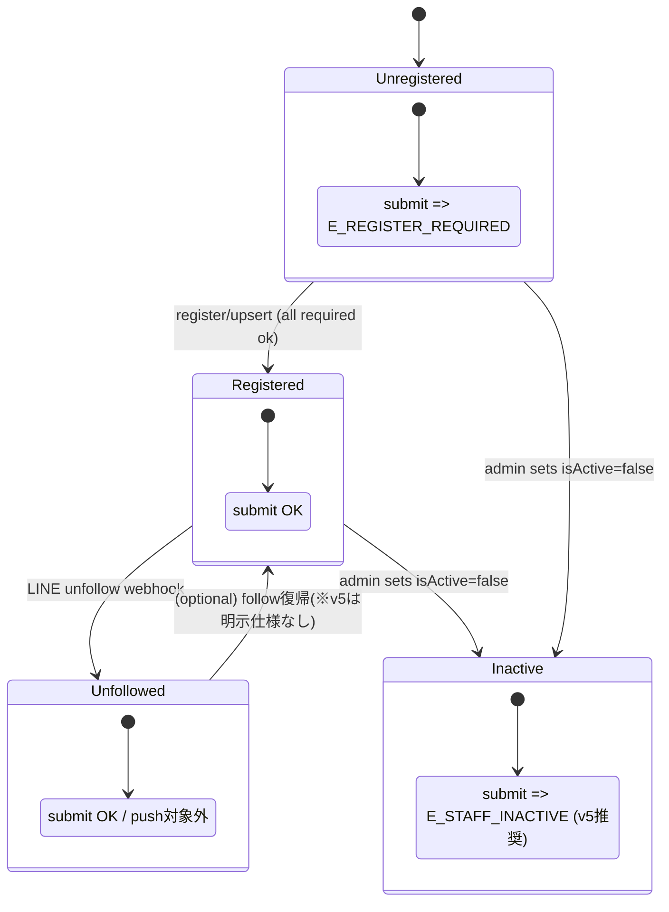

# State Machine (v5) — Project1

このドキュメントは、Project1（LINE × Worker × GAS × Sheets）の **運用状態（スタッフ状態 / 提出ゲート / 配信対象 / 送信ガード / 監査）** を
状態遷移として固定する。v5のDone Criteriaに従う。

参照（SoT）:
- [v5 Spec](./v5_spec.md)
- [Registration Spec](./registration_spec.md)
- [API I/O Schema](./api_schema.md)
- [Ops Rules](./ops_rules.md)
- [DX Core Audit Memo](./DX_CORE.md)

---

## 0. 用語

- **registered**: 必須登録項目が全て充足している状態。未充足は提出APIが拒否される。
- **isActive**: 在籍/無効フラグ（退職・休職など論理無効化）。
- **lineFollowStatus**: follow/unfollow（配信対象絞り込み）。unfollowでも提出はOK（v5運用）。
- **submit endpoints**: 交通費/経費/シフト/ホテル回答 等の提出系。登録未完了は `E_REGISTER_REQUIRED`。
- **send guard**: 一括配信やリマインドの重複送信防止（guard/result）。
- **ops.log / ADMIN_ALERTS**: 監査ログ・アラート記録。握りつぶし禁止。

---

## 1. スタッフ状態（Master）ステートマシン

### 1.1 スタッフ状態の軸

スタッフ状態は以下の3軸の直積で決まる（v5）：

1) Registration: `registered = true/false`（必須項目充足）  
2) Employment: `isActive = true/false`（在籍）  
3) Follow: `lineFollowStatus = follow/unfollow`（配信対象）

### 1.2 状態一覧（代表）

| State ID | registered | isActive | followStatus | 提出 | 配信 |
|---|---:|---:|---|---|---|
| S0 | false | true | follow | ❌（拒否） | ✅（登録促進は可） |
| S1 | true | true | follow | ✅ | ✅ |
| S2 | true | true | unfollow | ✅ | ❌（対象外） |
| S3 | true | false | follow | ❌（拒否推奨） | ❌ |
| S4 | false | false | unfollow | ❌ | ❌ |

提出/配信のルールは [ops_rules.md](./ops_rules.md) に従う。

---

## 2. 遷移イベント

### 2.1 登録フロー（LIFF）

- `GET /api/register/status`：登録状況と missingFields を返す  
- `POST /api/register/upsert`：必須項目を受け、正規化して staff master を upsert。充足で `registered=true`

**遷移**
- S0 → S1（登録完了 + isActive=true + follow）
- S0 → S2（登録完了 + isActive=true + unfollow の場合）

登録必須フィールドとバリデーションは [registration_spec.md](./registration_spec.md) を正とする。

---

### 2.2 unfollow webhook（LINEイベント）

- `eventType=unfollow` を受けたら `lineFollowStatus=unfollow` に更新  
- 以後、push配信対象から除外（hotel.push 等）

**遷移**
- S1 → S2
- S0 →（registered=falseのまま）follow→unfollow になり得る

---

### 2.3 isActive（在籍）変更

- 管理側運用で `isActive=false` にされる（退職・休職等）

**遷移**
- S1 → S3
- S2 →（registered=true, isActive=false, unfollow）= 配信対象外・提出拒否推奨

---

## 3. 提出ゲート（Submit Gate）ステートマシン

提出系の全エンドポイントに共通適用。

### 3.1 Gate判定

1) staff master なし or required不足 → `E_REGISTER_REQUIRED` で拒否（retryable=false）  
2) `isActive=false` → `E_STAFF_INACTIVE` で拒否（retryable=false, v5推奨）  
3) `lineFollowStatus=unfollow` → 提出OK（配信は対象外）

---

## 4. 配信（Push）対象ステートマシン（ホテルを例）

### 4.1 配信対象ルール

`hotel.push`（管理者）は **isActive=true かつ follow** を対象にする。

**対象**: S1 のみ（原則）  
**対象外**: S0 / S2 / S3 / S4

---

## 5. 送信ガード（Send Guard）ステートマシン

ホテル/リマインドの「二重送信防止」を guard/result の2段階で扱う。

### 5.1 状態（1メッセージ単位）

- G0: 未ガード
- G1: guard取得（送信してよい）
- G2: result記録（送信結果確定）
- Gx: guard拒否（重複/TTL内）

### 5.2 遷移（概念）

1) guardリクエスト → allowed なら G1、拒否なら Gx  
2) 送信実行（LINE Messaging API）  
3) resultリクエスト → G2（success/fail を記録）

---

## 6. 監査・アラート（No Silent Failure）

監査ログ/アラート記録に失敗した場合は握りつぶさず、warning等で可視化する（運用ルール）。  
v5は「監査が落ちても業務本体は継続し得る」が、**warningsで必ず露出**する設計が前提。

---

## 7. Mermaid（全体像・概念図）

